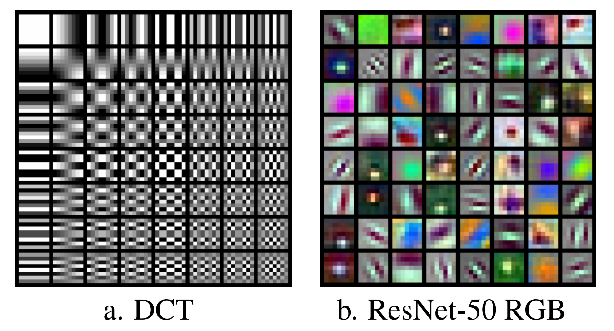

# Learning from compressed Audio

For audio, image, and video learning tasks, training data are typically stored using convential JPEG, MPEG, or H.264 encoded data.

At the time of training, the data are decoded from a blockwise frequency domain representation back into the time or spacial domain.

However in many models, the first layers effectively perform a similar blockwise frequency transform using subsampled learned filters.

Both the convential compression as well as the subsampled layers in a CNN perform the task of increasing information density.

Training on the conventionally compressed data instead (or a partially decoded version) holds potential for training speedup and simplified models.

Prior works have expored training on partially decoded images [(1)][1] and video [(2)][2]. In both cases improvements in training were found.

##  Goals

In my project, I hope to tackle a number of questions regarding learning from compressed audio.

1. How do conventional audio compression techniques compare to learned filters that increase information density?

2. How can course (<=8 bit) subband quantization be preserved while utilizing conventional 32-bit float GPU training hardware?

3. Which conventional audio compression techniques (subband quantization, vector quantization, linear predictive coding, etc) provide the best intermediate domain for learning?

## References

1. [Gueguen, Lionel, et al. "Faster neural networks straight from jpeg." Advances in Neural Information Processing Systems 31 (2018).][1]

2.[Wu, Chao-Yuan, et al. "Compressed video action recognition." Proceedings of the IEEE conference on computer vision and pattern recognition. 2018.][2]

[1]: https://proceedings.neurips.cc/paper/2018/hash/7af6266cc52234b5aa339b16695f7fc4-Abstract.html

[2]: https://openaccess.thecvf.com/content_cvpr_2018/html/Wu_Compressed_Video_Action_CVPR_2018_paper.html